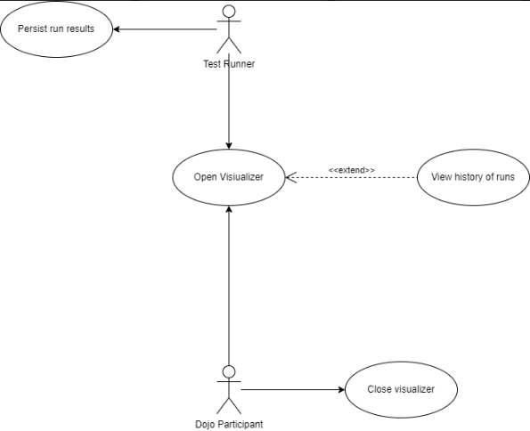
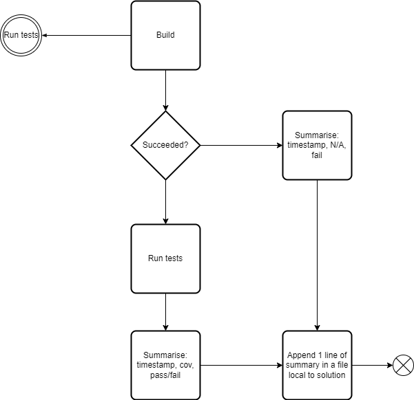

# TDD-Loop-Visualizer

An extension for Visual Studio to visualize test run flow (red, green) 

## Use Cases



## The way it works?



## Setup

### 1. Setup build outcome

The extension relies on pre/post build events.

Print in a "build-output.txt" "Fail" for pre event:

```
echo Fail > "$(ProjectDir)build-output.txt"
```

Print in a "build-output.txt" "Fail" for post event::

```
echo Success > "$(ProjectDir)build-output.txt"
```

If build failed - it will remain with the word "Fail".
If it succeeded - the word "Fail" will be overriden.

### 2. Setup code coverage

If you use the default template, for example for xUnit, it should be fine as-is as it comes with codecov setup.